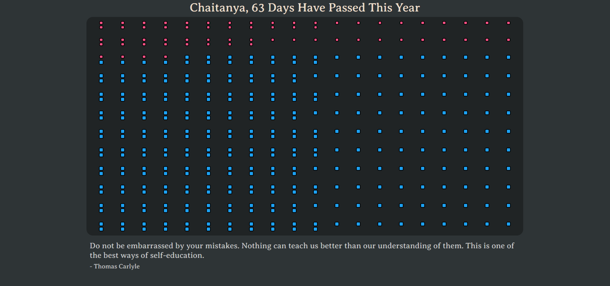

# Lakshya

Stay organized and mindful about your work by tracking the number of days that have passed in the year every time you open a new tab

### Installation

To install the Lakshya browser extension, follow these steps:

- Go to the Lakshya [GitHub repository](https://github.com/hokageCV/Lakshya)
- Click on the "Code" button and select "Download ZIP".
- Extract the downloaded ZIP file to a folder on your computer.
- Open your web browser and navigate to the extensions page. This can typically be done by typing "chrome://extensions" or "about:addons" in the URL bar.
- Enable developer mode by clicking on the toggle switch in the top right corner of the page.
- Click on the "Load unpacked" button and select the folder where you extracted the Lakshya extension files.
- The extension should now be installed and ready to use.

### Usage

After installing the extension, you will be redirected to an onboarding page where you will be prompted to enter your name. Once you complete the onboarding process, Lakshya will start displaying all the days of the year on a new tab page, with the days which have passed appearing in a different color.

Each day, Lakshya will display a new quote on the new tab page, providing you with daily inspiration to help you stay focused and motivated. You can choose to hide the quote by clicking on the "hide quote" button located at the bottom right corner of the page. If you change your mind and want to see the quote again, simply click on the "show quote" checkbox to bring it back.

In addition, Lakshya allows you to copy the daily quote to your clipboard by clicking on the quote itself. This feature comes in handy when you want to share the quote with your friends or use it as a daily affirmation.

You can also customize the title of the new tab page to your liking. To change the title, simply click on the "Edit Title" button located at the top left corner of the page, and enter your desired title.
